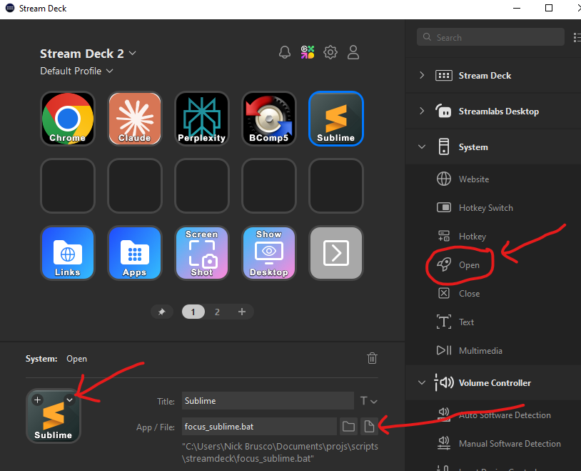

# SmartDeck
Scripts to make your Stream Deck useful for dev work

## Why?

The default Stream Deck app can only open new applications or URLs. This means:
- Pressing a Stream Deck button for Chrome always opens a new tab
- Pressing a button for an app always launches a new instance

This utility fixes that. Each app or website can now be:
- Opened by pressing the corresponding Stream Deck button
- If an instance is already open, it will focus that tab to the front
- If multiple instances of that app or website are open, pressing the button will cycle between them


## Quick Start
Currently supports windows 10. You'll need python 3.6+ 

First, clone the repo:
```git bash
git clone https://github.com/Bruscon/SmartDeck.git
```
Then install requirements
```anaconda prompt
pip install -r requirements.txt
```
Finally you'll need to make a batch script for each app or website you want on your Stream Deck. It's easier than it sounds, and examples are included in the repo for claude.ai, perplexity.ai, sublime, and BeyondCompare

## Example bash scripts
For websites (using `chrome_tab_switcher.py`):
```batch
@echo off
cd /d "%~dp0"
python "%~dp0chrome_tab_switcher.py" claude.ai
if errorlevel 1 (
    echo Failed to focus (website) with error code %errorlevel%
    timeout /t 3
)
```

For applications (using `app_focus.py`):
```batch
@echo off
cd /d "%~dp0"
python "%~dp0app_focus.py" "C:\Path\To\App.exe"
if errorlevel 1 (
    echo Failed to focus (application) with error code %errorlevel%
    timeout /t 3
)
```

Tip: If you want these scripts to execute visibly, you can change their extension to .cmd

## Linking scripts to your Stream Deck

Once you've created your scripts, launch the stream deck application. On the right panel find system > launch. Drag that icon into an open slot. Fill in the path to your bash script from the above step. Optionally, add an icon. 



Thats it!

## Configuration

Both utilities create their own config files (.json) and logs the first time they run. You shouldn't need to modify these manually.

## License

MIT License
